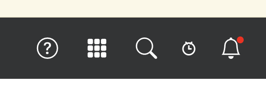
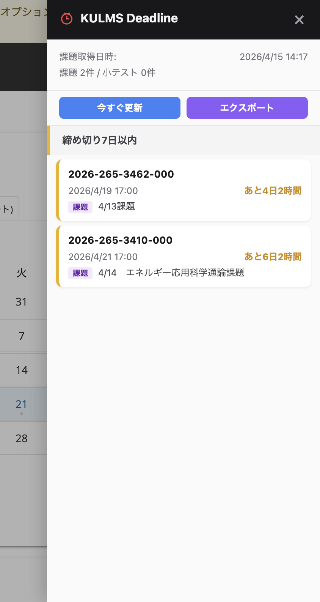

<div align="center">

<h1>kulms-tools</h1>

<p><strong>京大生のための KULMS 自動化ツールキット</strong></p>

<p>
  <a href="https://github.com/youtaichilai4-maker/kulms-tools/blob/main/LICENSE"></a>
  
  
  
  <a href="https://github.com/youtaichilai4-maker/kulms-tools/issues"></a>
  <a href="https://github.com/youtaichilai4-maker/kulms-tools/pulls"></a>
</p>

<p>
  KULMS の締切リマインド・授業資料の自動同期・AI CLI ツール連携を<br>
  ワンセットで提供するオープンソースのツールキットです。
</p>

<br>

<table>
  <tr>
    <td align="center" width="33%">
      <br>
      <strong>締切リマインド</strong><br>
      <sub>KULMS サイト上にサイドパネルで<br>課題・小テストの締切を色分け表示</sub><br><br>
    </td>
    <td align="center" width="33%">
      <br>
      <strong>資料の自動同期</strong><br>
      <sub>差分検出で新規・更新資料だけを<br>ワンコマンドでダウンロード</sub><br><br>
    </td>
    <td align="center" width="33%">
      <br>
      <strong>AI CLI 連携</strong><br>
      <sub>Claude Code / Codex CLI で<br>課題・資料に直接アクセス</sub><br><br>
    </td>
  </tr>
</table>

</div>

---

## How It Works

<div align="center">

<p>KULMS の画面に<strong>時計型のアイコン</strong>が出現。タップして各種機能を使ってみよう。</p>

<br>

<table>
  <tr>
    <td align="center">
      
      <br><br>
      <strong>1. ヘッダーに時計アイコンが追加される</strong><br>
      <sub>KULMS サイトのナビゲーションバーに自動で組み込まれる。<br>通知ベルの隣に配置されるので、いつでもワンタップでアクセス。</sub>
    </td>
  </tr>
  <tr><td><br></td></tr>
  <tr>
    <td align="center">
      
      <br><br>
      <strong>2. サイドパネルで締切を一覧表示</strong><br>
      <sub>タップするとサイドパネルがスライドイン。<br>課題・小テストの締切を緊急度別に色分け表示。<br>「<strong>今すぐ更新</strong>」でデータを即時リフレッシュ、<br>「<strong>エクスポート</strong>」でローカル同期用の JSON を出力。</sub>
    </td>
  </tr>
</table>

</div>

<br>

---

## Quick Start

```bash
git clone https://github.com/youtaichilai4-maker/kulms-tools.git
cd kulms-tools
```

<table>
<tr><td>

### Step 1 &mdash; Chrome 拡張機能をインストール

1. Chrome で `chrome://extensions` を開く
2. 右上の **「デベロッパーモード」** を ON
3. **「パッケージ化されていない拡張機能を読み込む」** → `extension/` を選択

</td></tr>
<tr><td>

### Step 2 &mdash; エクスポート

1. [KULMS](https://lms.gakusei.kyoto-u.ac.jp) にログイン
2. 拡張機能のポップアップ or サイドパネルで **「エクスポート」** をクリック
3. `kulms-export-YYYY-MM-DD.json` が `~/Downloads/` に自動保存される

</td></tr>
<tr><td>

### Step 3 &mdash; ローカル同期

```bash
python kulms-sync.py
```

引数なしで OK。`~/Downloads` から最新の JSON を自動検出し、`courses/` に同期します。

</td></tr>
</table>

<br>

<details>
<summary><strong>生成されるディレクトリ構造</strong></summary>
<br>

```
courses/
  電磁エネルギー学/
    README.md                  ← コース情報
    resources/
      1 イントロ.pdf            ← 自動ダウンロード済み
      Part I.pdf
    assignments/
      413課題/
        README.md              ← 締切・課題内容
  物理化学特論/
    resources/
      物理化学特論1.pdf
    ...
```

</details>

<details>
<summary><strong>出力先を指定する場合</strong></summary>
<br>

```bash
python kulms-sync.py kulms-export-2026-04-15.json courses/m1-2026-spring
```

第1引数: JSON パス、第2引数: 出力ディレクトリ。どちらも省略可。

</details>

---

## Features

### Chrome Extension (`extension/`)

<table>
  <tr>
    <th width="200">機能</th>
    <th>説明</th>
  </tr>
  <tr>
    <td><strong>締切リマインド</strong></td>
    <td>KULMS サイト上にサイドパネルを追加。課題・小テストの締切を緊急度別に色分け表示（赤 → 24h以内、オレンジ → 3日以内、黄 → 7日以内、緑 → 14日以内）</td>
  </tr>
  <tr>
    <td><strong>バッジ通知</strong></td>
    <td>24時間以内の締切数を拡張機能アイコンのバッジにリアルタイム表示</td>
  </tr>
  <tr>
    <td><strong>コースデータ エクスポート</strong></td>
    <td>全サイトの課題詳細・資料メタデータ・小テスト情報を構造化 JSON で一括出力</td>
  </tr>
  <tr>
    <td><strong>認証情報の同梱</strong></td>
    <td>セッション Cookie を JSON に含め、ローカルでの資料ダウンロードを可能にする（30分で自動失効）</td>
  </tr>
</table>

### Sync Script (`kulms-sync.py`)

<table>
  <tr>
    <th width="200">機能</th>
    <th>説明</th>
  </tr>
  <tr>
    <td><strong>ゼロコンフィグ</strong></td>
    <td><code>python kulms-sync.py</code> だけで動作。外部パッケージ不要（Python 標準ライブラリのみ）</td>
  </tr>
  <tr>
    <td><strong>自動検出</strong></td>
    <td><code>~/Downloads</code> から最新の export JSON を自動で見つける</td>
  </tr>
  <tr>
    <td><strong>差分ダウンロード</strong></td>
    <td>ファイルの有無 + サイズ比較で新規・更新・スキップを判定</td>
  </tr>
  <tr>
    <td><strong>自動クリーンアップ</strong></td>
    <td>処理後に Cookie 入り JSON を自動削除</td>
  </tr>
</table>

---

## Diff Sync

毎回エクスポート → `python kulms-sync.py` するだけで、差分のみが同期されます。

```
KULMS (リモート)                    ローカル (courses/)             判定
━━━━━━━━━━━━━━━━━━━━━━━━━━━━━━━━━━━━━━━━━━━━━━━━━━━━━━━━━━━━━━━━━━━━━
lecture01.pdf   100KB         →    lecture01.pdf   100KB          SKIP
lecture02.pdf   200KB         →    lecture02.pdf   150KB          UPD  (再DL)
lecture03.pdf   300KB         →    (存在しない)                     NEW  (新規DL)
```

---

## AI CLI Integration

ローカルに資料と課題情報があることで、AI CLI ツールからシームレスにアクセスできます。

<table>
<tr>
<td width="50%">

**Claude Code**

```bash
cd courses/電磁エネルギー学

# 課題の構成案を作る
claude "assignments/413課題/README.md
を読んで、レポートの構成案を作って"

# 講義資料を要約
claude "resources/ の PDF を読んで、
今週の講義内容をまとめて"
```

</td>
<td width="50%">

**Codex CLI**

```bash
# 今週の締切を一覧
codex "courses/ 内の全課題から、
今週締切のものを一覧にして"

# 資料を横断検索
codex "courses/ の全 PDF から
'エントロピー' に関する記述をまとめて"
```

</td>
</tr>
</table>

> **KULMS のブラウザ画面を行き来する必要はありません。**
> ローカルにファイルがあるからこそ、AI ツールがコンテキストとして読み込めます。

---

## Security

<table>
  <tr>
    <th width="200">対策</th>
    <th>内容</th>
  </tr>
  <tr>
    <td><code>.gitignore</code></td>
    <td><code>kulms-export-*.json</code> と <code>courses/*/</code> をリポジトリから除外。fork/clone しても他人のデータは見えません</td>
  </tr>
  <tr>
    <td>セッション有効期限</td>
    <td>Cookie に <code>expiresAt</code>（エクスポートから30分後）を付与。期限切れならDLをスキップ</td>
  </tr>
  <tr>
    <td>自動削除</td>
    <td>スクリプトは処理完了後に JSON ファイルを自動削除</td>
  </tr>
  <tr>
    <td>短命セッション</td>
    <td>Sakai のセッションは30〜60分の無操作で失効。仮に漏洩しても影響は限定的</td>
  </tr>
</table>

---

## Repository Structure

```
kulms-tools/
  extension/               Chrome 拡張機能 (Manifest V3)
  │  manifest.json
  │  background.js         API 通信・エクスポート・バッジ更新
  │  content.js            サイドパネル UI
  │  popup.js / .html      ポップアップ UI
  │  styles.css            パネルスタイル
  │  popup.css             ポップアップスタイル
  │  icons/
  │
  courses/                 授業ディレクトリ (gitignored)
  kulms-sync.py            ローカル同期スクリプト (Python 3, stdlib のみ)
  docs/adr/                Architecture Decision Records
```

---

## Requirements

| 項目 | バージョン |
|---|---|
| Chrome | Manifest V3 対応 (Chrome 88+) |
| Python | 3.7+ |
| 外部パッケージ | **不要** (stdlib のみ) |
| アカウント | 京都大学 KULMS |

---

## Contributing

<div align="center">

**京大生の開発者を歓迎します！**

Issue でバグ報告・機能要望 / Pull Request でコード改善

</div>

### Roadmap / 改善アイデア

- [ ] GUI 同期ツール（CLI が使えなくてもダブルクリックで資料同期できるデスクトップアプリ）
- [ ] 資料の自動ダウンロード（Native Messaging で `~/Downloads` を経由しない）
- [ ] 締切の Google Calendar / Apple Calendar 連携
- [ ] KULMS のお知らせ・掲示板の取得
- [ ] 成績情報の取得と可視化
- [ ] CLI から直接エクスポート（ヘッドレス認証）
- [ ] Firefox 対応

一緒に京大の学習体験を改善しましょう。アイデアだけでも [Issue](https://github.com/youtaichilai4-maker/kulms-tools/issues) に投げてください。

---

<div align="center">

<sub>MIT License &copy; 2026 youtaichilai4-maker</sub>

</div>
